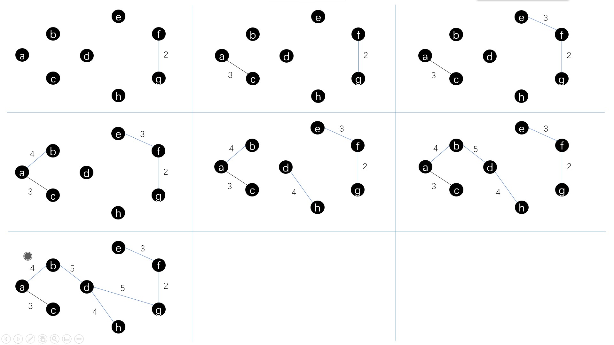

# 数据结构作业
<br/>

***
# 7.7
## 7.7.1
邻接矩阵：
| |a|b|c|d|e|f|g|h|
|-|-|-|-|-|-|-|-|-|
|a|∞|4|3|∞|∞|∞|∞|∞|
|b|4|∞|5|5|9|∞|∞|∞|
|c|3|5|∞|5|∞|∞|∞|5|
|d|∞|5|5|∞|7|6|5|4|
|e|∞|9|∞|7|∞|3|∞|∞|
|f|∞|∞|∞|6|3|∞|2|∞|
|g|∞|∞|∞|5|∞|2|∞|6|
|h|∞|∞|5|4|∞|∞|6|∞|


## 7.7.2
邻接表：  
a -> 2 -> 1^  
b -> 0 -> 2 -> 3 -> 4^  
c -> 7 -> 3 -> 1 -> 0^  
d -> 1 -> 2 -> 7 -> 6 -> 5 -> 4^  
e -> 1 -> 3 -> 5^  
f -> 4 -> 3 -> 6^  
g -> 5 -> 3 -> 7^  
h -> 6 -> 3 -> 2^  

<br/><br/><br/><br/>
***


# 7.10

|      |α|A|B|C|D|E|F|G|H|I|J|K|ω|
|------|-|-|-|-|-|-|-|-|-|-|-|-|-|
|ve(vi)|0|1|6|17|3|34|4|3|13|1|31|22|44|
|vl(vi)|0|20|24|26|19|34|8|3|13|7|31|22|44|
<br/><br/>
|     |<α,A>|<α,B>|<α,D>|<α,F>|<α,G>|<α,I>|<A,C>|<B,C>|
| --  | --- | --- | --- | --- | --- | --- | --- | --- |
|e(ai)|0|0|0|0|0|0|0|1|6|
|l(ai)|19|18|16|4|0|6|20|24|
|     |<D,C>|<D,E>|<D,J>|<F,E>|<F,H>|<G,ω>|<G,H>|<I,H>|
|e(ai)|3|3|3|4|4|3|3|1|
|l(ai)|19|26|25|23|8|23|3|7|
|     |<C,E>|<H,C>|<H,J>|<H,K>|<K,J>|<J,E>|<J,ω>|<E,ω>|
|e(ai)|17|13|13|13|22|31|31|34|
|l(ai)|26|22|27|13|22|31|32|34|
<br/>
关键路径：α -> G -> H -> K -> J -> E -> ω

<br/><br/><br/><br/>
***
# 7.11


<br/><br/><br/><br/>
***
# 7.22
下面是实现算法的两个主要函数
```
//返回顶点u在图/网中的位置
int LocateVex(ALGraph G, VertexType u) {
    int i;
    
    for(i = 0; i < G.vexnum; i++) {
        if(G.vertices[i].data == u) {
            return i;
        }
    }
    return -1;
}
//通过深度优先遍历，判断顶点vi到vj之间是否存在路径
void Alg(ALGraph G, VertexType vi, VertexType vj) {
    int i, j, k;
    int path[MAX_VERTEX_NUM + 1];
    
    for(k = 0; k < G.vexnum; k++) {
        vis[k] = FALSE;
    }
    
    i = LocateVex(G, vi);
    j = LocateVex(G, vj);
    
    path[0] = 0;
    
    if(DFS_7_22(G, i, j, path) == ERROR) {
        printf("%c 到 %c 之间不存在通路！\n", vi, vj);
        return;
    }

    printf("%c 到 %c 之间的通路为：", vi, vj);
    for(k = 1; k <= path[0]; k++) {
        printf("%c ", GetVex(G, path[k]));
    }
    printf("\n");
}

//深度优先遍历图G，查找顶点i到顶点j之间的路径存入path
static Status DFS(ALGraph G, int i, int j, int path[MAX_VERTEX_NUM + 1]) {
    int w;
    
    // 将顶点i加入路径
    vis[i] = TRUE;
    path[0]++;
    path[path[0]] = i;
    
    if(i == j) {
        return OK;
    }
    
    // 遍历vi所有邻接点
    for(w = FirstAdjVex(G, GetVex(G, i)); w >= 0; w = NextAdjVex(G, GetVex(G, i), GetVex(G, w))) {
        // 跳过已访问的顶点
        if(vis[w]) {
            continue;
        }
        
        // 递归(深度优先)
        if(DFS(G, w, j, path) == OK) {
            return OK;
        }
    }
    
    // 移除顶点i
    vis[i] = FALSE;
    path[0]--;
    
    return ERROR;
}
```

<br/><br/><br/><br/>
***

## 7.27  
下面是实现算法的主要函数
```
Status PathGra(ALGraph G, int start, int end, int k, int path[MAX_VERTEX_NUM]) {
    int w;
    
    path[0]++;
    path[path[0]] = start;
    vis[start] = TRUE;  // 标记该顶点已访问
    
    // 如果遇到终点，则需要视情形返回
    if(start == end) {
        // 顶点数 = 路径长度+1
        if(path[0] == k + 1) {
            return OK;
        }
    } else {
        // 深度优先遍历
        for(w = FirstAdjVex(G, G.vertices[start].data);
            w >= 0;
            w = NextAdjVex(G, G.vertices[start].data, G.vertices[w].data)) {
            // 忽略已访问过的顶点
            if(vis[w] == TRUE) {
                continue;
            }
            
            if(PathGra(G, w, end, k, path) == OK) {
                return OK;
            }
        }
    }
    
    // 从路径中移除该顶点，并将其状态降级为"已访问"
    path[0]--;
    vis[start] = FALSE;  // 清除访问标记
    
    return ERROR;
}
```